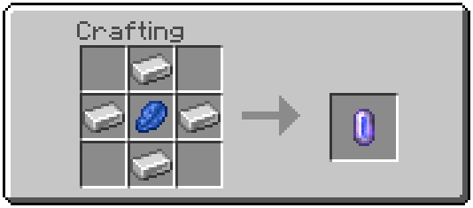
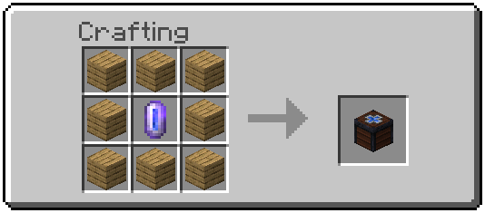
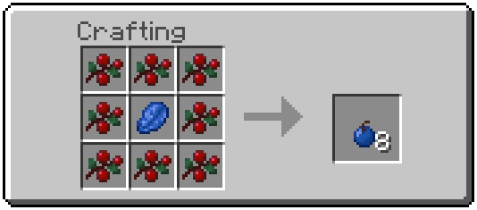

# RecallStations

An easy way to return to your home/base in Minecraft Bedrock Edition. (This does not work with Minecraft Java Edition!)

## What is it?

This is a little behavior pack bundled with a resource pack that allows you to that a Recall Anchor and some Recall Berries.

See also this clip with sound in [HD](demo/demoHD.mp4) or [FHD](demo/demoFHD.mp4)

## Usage
Craft a Recall Anchor and some Recall Berries. Right click on the Recall Anchor with a berry to mark the location. Now you can eat a berry in order to get teleported to it.

## Recipes

It uses simple recipes in order to make these items approachable for beginner players.

First of all you need to craft a Recall Core in order to craft a Recall Anchor.

This is a Recall Anchor. It allows you to mark a spot to get teleported to, if you eat a Recall Berry.

This one gets you 8 Recall Berries, if eaten you will get teleported to your last marked Recall Anchor.

## Installation

1. Download the *mcpacks* from the [release page](https://github.com/derPiepmatz/Recall-Stations/releases/latest).
2. Open both the *mcpacks* with your Minecraft Bedrock Edition. They should get imported automatically.
3. Now if you want the pack in world. Go to the world setting before launching in one and select 'Use Experimental Gameplay'. After that you can select the pack under 'Add-Ons/Behavior Packs'. The resource pack will automatically insert into the world as well.
4. Now you can have fun with little pack. Hope you don't get lost ever again.

## Motivation

My little sister, currently in elementary school, plays a lot of Minecraft on her tablet. Sometimes we do play together and she gets lost a lot. Because of that I created to package to help her find the way back home easily. That's the reason why this pack uses so easy recipes.
